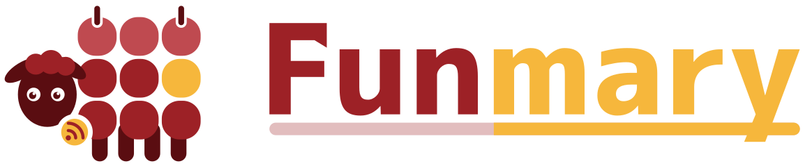

<div align="center">
  <picture>
    <source media="(prefers-color-scheme: dark)" srcset="docs/assets/logo-dark.svg" />
    
  </picture>
</div>

<div align="center">

# Funmary

[](https://github.com/funmary-app/funmary/actions/workflows/ci.yml)
[](#ライセンス)
[](https://x.com/funmary_app)
[](https://note.com/funmary)


</div>

---

Funmary (ファンマリー) は、公立はこだて未来大学の学生向けの便利な総合 Web アプリです。

> [!IMPORTANT]
> Funmary は大学とは関係のない非公式のアプリです。大学への問い合わせには使わないでください。

## できること

学生ポータルの休講、補講、教室変更を、自分の時間割にまとめて出し、いつものカレンダーや Discord に届けます。利用は招待制です。

- 休講、補講、教室変更、祝日、振替授業日を反映した、今日と 1 週間の時間割
- 授業の詳細 (曜日と時限、教室、教員、公開シラバスの内容、休講などの履歴)
- 履修科目の登録。学生ポータルの時間割からの取り込みと、科目を探しての登録ができます
- 授業の予定を Google カレンダーや iPhone のカレンダーに自動で届ける購読 URL (ICS)
- 休講などの知らせを、アプリ内の通知欄、Discord (サーバー、ダイレクトメッセージ、Webhook)、利用者が用意した Webhook、RSS、Atom、JSON Feed で受け取る機能
- 自分の AI エージェントやスクリプトから時間割と休講を読める、公開 API (OpenAPI) と MCP サーバー (claude.ai などのコネクタからは、OAuth で許可してつなげます)。Discord のスラッシュコマンド (`/today`、`/week`、`/changes`) でも答えます
- 大学の Google アカウントでのログインと、招待コードによる新規登録

これから、ブラウザのプッシュ通知、授業前のリマインダー、欠席の記録、時間割の共有などを足していきます。

## お知らせ

新しい機能や、開発の様子は、公式のアカウントで出しています。

- X: [@funmary_app](https://x.com/funmary_app)
- note: [funmary](https://note.com/funmary)

## 使っている技術

| 分野           | 使うもの                                    |
| -------------- | ------------------------------------------- |
| 画面           | SvelteKit、Svelte 5、SMUI (Material Design) |
| API            | Hono (SvelteKit の中で動かす)、OpenAPI、MCP |
| データ         | SQLite (better-sqlite3、Drizzle ORM)        |
| 検証           | Valibot                                     |
| 定期処理       | croner (同じプロセスの中で動かす)           |
| 実行環境       | Node.js 24 系 (LTS)                         |
| パッケージ管理 | pnpm workspace                              |
| 検査           | TypeScript、ESLint、Prettier、commitlint    |
| テスト         | Vitest、Playwright                          |
| 依存の更新     | Renovate                                    |

サーバーは VPS 1 台で、Node.js のプロセス 1 つと SQLite のファイル 1 つだけで動かします。設計の考え方と、その理由は [docs/design/](docs/design/README.md) にまとめています。

## セルフホストする

自分の VPS で Funmary を動かす手順は [docs/self-hosting.md](docs/self-hosting.md) にあります。

## 開発に参加する

手元で動かす手順と、コミットメッセージやブランチの決まりは [CONTRIBUTING.md](CONTRIBUTING.md) にあります。AI エージェントで開発するときの指示は [AGENTS.md](AGENTS.md) にあります。

開発は [funmary-app/funmary](https://github.com/funmary-app/funmary) で行っています。[otnc/funmary-mirror](https://github.com/otnc/funmary-mirror) は自動で複製しているミラーなので、Issue と PR は funmary-app/funmary に送ってください。

セキュリティ上の問題を見つけたときは、公開の Issue にせず、[SECURITY.md](SECURITY.md) の方法で知らせてください。

## ディレクトリ構成

```
funmary/
├── apps/
│   └── web/          # SvelteKit の画面。本番の入口と、管理用コマンドもここ
├── packages/
│   ├── core/         # I/O を持たない処理 (時間割の展開、祝日と学期の判定など)
│   ├── db/           # スキーマ、マイグレーション、クエリ
│   ├── auth/         # Google ログイン、セッション、招待コード
│   ├── api/          # Hono のアプリ (/api、/cal、/feed、/mcp など)
│   ├── sources/      # 学生ポータル、公開シラバス、学年暦、祝日の取得と解析
│   ├── notify/       # Discord と Webhook への通知
│   ├── jobs/         # 定期処理
│   └── log/          # ログ
├── deploy/           # systemd の unit、nginx の設定、更新スクリプト
├── docs/             # 設計書、セルフホストの手順
├── scripts/          # ビルドや検査の補助
└── .agents/skills/   # AI エージェント向けのスキル
```

## 著者

- otoneko. a.k.a. marron. https://github.com/otnc
- Oto Lab https://github.com/oto-lab

## 貢献者

[](https://github.com/funmary-app/funmary/graphs/contributors)

## ライセンス

Funmary のコードは、次の 2 つのライセンスのどちらかを選んで使えます (デュアルライセンス。SPDX の式では `BSD-3-Clause OR Apache-2.0`)。

- BSD 3-Clause License ([LICENSE-BSD-3-CLAUSE](LICENSE-BSD-3-CLAUSE))
- Apache License, Version 2.0 ([LICENSE-APACHE-2.0](LICENSE-APACHE-2.0))

Funmary に送られた貢献も、追加の条件なしに同じ 2 つのライセンスで受け取ります。初めての PR のときに、このことへの同意をお願いしています (Bot を除くすべての人が対象です。PR に案内のコメントが届きます)。

ロゴとアイコンは、この 2 つのライセンスの対象外です。Funmary を宣伝、紹介する目的では改変せずに使えますが、セルフホストを含むサービスの運営に使うには許可が要ります。詳しくは [LICENSE-ASSETS](LICENSE-ASSETS) を見てください。

## クレジット

ロゴの文字には、フォント「07あかずきんポップ」を使っています。フリーダウンロード: <https://flopdesign.booth.pm/items/1748058>
