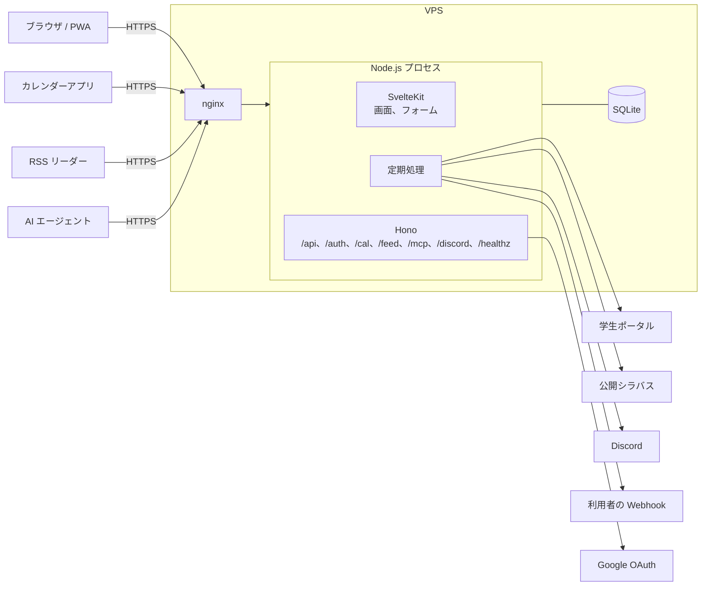

# 2. 構成

画面は SvelteKit、機械が呼ぶ口は Hono が受け持ちます。どちらも 1 つの Node.js のプロセスの中で動きます。



Funmary のために VPS の上で動かすのは、Node.js のプロセス 1 つだけです。HTTPS は VPS ですでに動いている nginx が受け持ちます。

- **SvelteKit** は人が見る画面を担当します。データの読み書きは `load` 関数とフォームアクションで行い、JavaScript が動かない環境でも主な操作ができるようにします
- **Hono** は機械が呼ぶ口を担当します。カレンダーアプリが取りに来る ICS、RSS リーダーが取りに来るフィード、公開 API と MCP、Google ログインのリダイレクト、Discord からのスラッシュコマンド、死活監視の `/healthz` がこれにあたります
- **定期処理** は同じプロセスの中で croner が起動します。OS の cron やジョブキューは使いません。外部のサービスに接続するのは定期処理だけで、画面や API の処理中には接続しません ([3.5](03-quality.md#35-壊れにくさとフォールバック))
- **データ** は SQLite のファイル 1 つに置きます。DB サーバーは立てません

## 2.1 Hono を採用する理由

SvelteKit の `+server.ts` だけでも API は書けます。それでも Hono を使うのは、機械向けの口に必要な部品がそろっているからです。

- ETag、セキュリティヘッダ、CSRF 対策、タイムアウトのミドルウェアが標準で入っています。ICS の `304 Not Modified` は ETag のミドルウェアで済みます
- フィードは hono-feed でそのまま配信できます
- `app.request()` でサーバーを起動せずにテストできます
- 画面と切り離しておけば、新しいクライアントや API を足すときも、画面側に手を入れずに済みます
- 依存がなく、小さいです

## 2.2 Hono は SvelteKit のフックから呼ぶ

別の HTTP サーバーは立てず、SvelteKit の `hooks.server.ts` で対象のパスだけ Hono に渡します。起動するサーバーは adapter-node の 1 つで済みます。

```ts
// apps/web/src/hooks.server.ts (簡略にしたもの)
const API_PATHS = ['/api', '/auth', '/cal', '/discord', '/feed', '/healthz', '/mcp', '/signup'];

export const handle: Handle = async ({ event, resolve }) => {
  const path = event.url.pathname;
  if (api && API_PATHS.some((prefix) => path === prefix || path.startsWith(`${prefix}/`))) {
    return api.fetch(event.request);
  }
  return resolve(event);
};
```

セッションの読み取りは `@funmary/auth` にまとめ、SvelteKit のフックと Hono のミドルウェアの両方から同じ関数を呼びます。

## 2.3 AI エージェントと外部のプログラム向けの口: 公開 API と MCP

利用者は、自分の時間割と休講を、AI エージェントや自作のスクリプト、iPhone のショートカットから読めます。AI エージェントは、Claude、ChatGPT、Cursor などを想定しています。「今日の授業は?」と聞けば、エージェントが Funmary に問い合わせて答えます。

### 2 つの口を、同じ処理の上に作る

| 口           | パス                     | 向いている使い方                                                                           |
| ------------ | ------------------------ | ------------------------------------------------------------------------------------------ |
| 公開 API     | `/api/v1/...` (JSON)     | スクリプト、ショートカット、ほかのアプリ。OpenAPI の定義があるので、呼び方を機械的に知れる |
| MCP サーバー | `/mcp` (Streamable HTTP) | AI エージェント。エージェントが道具 (tools) の一覧を読み、自分で選んで呼ぶ                 |

- どちらも Hono の上に置き、SvelteKit のフックから渡すパスに `/mcp` を足しています
- 読み取りの処理 (今日の授業、週の時間割、休講などの一覧、授業の詳細、通知欄) は 1 か所にまとめ、画面、公開 API、MCP から同じ関数を呼びます。口ごとに結果が食い違わないようにするためです
- 最初は**読み取りだけ**にしています。書き込み (欠席の記録、既読にするなど) は、読み取りを使ってもらってから、必要なものだけを足します
- 画面や API と同じく、DB に保存済みのデータだけを返します。エージェントが何度問い合わせても、学生ポータルなど大学のサービスへの接続は増えません ([3.5](03-quality.md#35-壊れにくさとフォールバック))

### 公開 API と、内部の API を分ける

`/api/` の下には、画面が使う内部の API (未読数など) もあります。内部の API はログインの Cookie で認証し、形は予告なく変えます。公開 API は `/api/v1/` の下に分け、アクセストークンで認証し、形を保ちます。形を壊す変更は `/api/v2/` を作って行い、`v1` はしばらく残します。

| メソッドとパス                                      | 返すもの                                                 |
| --------------------------------------------------- | -------------------------------------------------------- |
| `GET /api/v1/me`                                    | トークンの持ち主の表示名と、許されている範囲 (scope)     |
| `GET /api/v1/lessons`                               | 日付または期間の授業。休講、補講、教室変更を反映したもの |
| `GET /api/v1/lessons/next`                          | 次の授業 (授業中ならその授業)                            |
| `GET /api/v1/timetable`                             | 授業 (時刻つき) と、振替授業日、全学の休講日、祝日       |
| `GET /api/v1/periods`                               | 時限ごとの開始と終了の時刻                               |
| `GET /api/v1/courses`                               | 履修登録した科目と、その曜日と時限                       |
| `GET /api/v1/academic-calendar`                     | 年度の学期の期間と、祝日、全学の休講日、振替授業日       |
| `GET /api/v1/events`                                | 自分の予定と、時間割に加えた予定                         |
| `GET /api/v1/status`                                | 休講などのデータが新しいか                               |
| `GET /api/v1/subjects`                              | 科目の検索 (公開の科目だけ)                              |
| `GET /api/v1/subjects/{year}/{syllabusId}/sessions` | 科目の全授業日                                           |
| `GET /api/v1/changes`                               | 休講、補講、教室変更の一覧                               |
| `GET /api/v1/subjects/{year}/{syllabusId}`          | 授業の詳細 (公開シラバスの内容、教員、教室、休講の履歴)  |
| `GET /api/v1/notifications`                         | 通知欄                                                   |

### OpenAPI と Swagger UI

- 入出力の型は Valibot で書き、hono-openapi で OpenAPI 3.1 の定義を作ります。検証の型と文書が 1 つの定義から出るので、食い違いません
- 定義は `/api/v1/openapi.json` で配ります。クライアントの自動生成や ChatGPT の Actions など、ほかのツールにそのまま読ませられます
- `/api/docs` に Swagger UI を出します。文書のページには利用者のデータを載せないので、ログインなしで開けます
- 通知を送る Webhook の JSON の形は、同じ定義の `webhooks` に書いています

### MCP の道具

| 道具                    | 内容                                                                   |
| ----------------------- | ---------------------------------------------------------------------- |
| `get_lessons`           | 日付か期間の授業 (時刻つき) と、振替授業日などを返す。日付を省くと今日 |
| `get_next_lesson`       | 今の時刻から見た、次の授業                                             |
| `list_events`           | 自分の予定と、時間割に加えた予定                                       |
| `get_data_status`       | 休講などのデータが新しいか                                             |
| `search_subjects`       | 科目の検索 (公開の科目だけ)                                            |
| `get_subject_sessions`  | 科目の全授業日                                                         |
| `get_periods`           | 時限ごとの開始と終了の時刻                                             |
| `list_courses`          | 履修登録した科目と、その曜日と時限                                     |
| `get_academic_calendar` | 年度の学期の期間と、祝日、全学の休講日、振替授業日                     |
| `list_changes`          | 休講、補講、教室変更の一覧                                             |
| `get_subject`           | 授業の詳細                                                             |
| `list_notifications`    | 通知欄                                                                 |

- 道具はすべて読み取り専用の印 (`readOnlyHint`) を付けます。エージェントが確認なしに呼んでも、何も変わりません
- 結果は、機械が読める形 (`structuredContent`) と、人が読める短い文の両方で返します
- 公式の SDK (`@modelcontextprotocol/sdk`) と `@hono/mcp` を使います。SDK は道具の引数の型に zod を使うので、MCP の部分だけ zod が入ります。ほかの部分は Valibot のままにして、zod を持ち込みません

### 利用規約への同意

登録のあと、そして利用規約かプライバシーポリシーを更新したあとは、ログインしている全員に、同意の画面 (`/consent`) で同意を求めます。同意するまでは、すべての機能を止めます。

- 求める版は、2 つの文書の最終更新日 (`apps/web/src/lib/legal-versions.ts`) のうち、新しいほうの日付です。どちらかの日付を書き換えると、全員がもう一度同意します。同意した版と日時は利用者に持たせ、履歴は `terms_acceptances` に残します
- 画面 (`/app` と、API の同意の画面) は、同意の画面へ送ります。フォームの送信などは 403 です。同意のあとは、行こうとした画面へ戻ります
- 公開 API は、403 と `error: "terms_not_accepted"` を返します。トークンは正しいので 401 にはしません (クライアントが認証をやり直そうとしないため)。本文の `consentUrl` と、`Link` ヘッダに、同意の画面の URL を入れます
- MCP は、HTTP のエラーにしません。クライアントが、接続の失敗としか表示しないことが多いためです。データの道具の代わりに、同意が要ることと URL を答える道具を 1 つだけ出します
- Discord のコマンドは、答えの代わりに同意の画面を案内します。通知の配信と毎日のまとめは、同意するまで送らず、待たせておきます。カレンダーと RSS の購読は、403 と説明を返します
- 規約の本文 (`/terms`、`/privacy`)、ログイン、ログアウトは、同意の前でも使えます

### 認証

個人用のアクセストークンで認証します。設定画面で発行し、`Authorization: Bearer <トークン>` で送ります。

- 名前 (どこで使うか)、範囲 (scope)、有効期限を付けて発行します。範囲は `read:lessons`、`read:changes`、`read:notifications` に分けています
- トークンは発行したときに 1 回だけ見せ、DB にはハッシュだけを保存します。最後に使った日時を記録し、設定画面の一覧からいつでも無効にできます
- 見分けやすいように先頭に `fmy_` を付けます。GitHub の secret scanning などで、誤って公開されたトークンに気づきやすくするためです
- Web 版の Claude や ChatGPT のコネクタは、OAuth での認可を前提にしています。この対応は、利用者が増えてから考えます

### 守ること

- トークンで読めるのは、その持ち主のデータだけです。全体の休講の一覧も、ログインした利用者が画面で見られる範囲を超えません
- 回数制限を、トークンごとに hono-rate-limiter で掛けます (1 分に 60 回)
- 公開 API と MCP には CORS を開けません。ほかのサイトのブラウザから呼ぶ使い方は想定しません。Cookie では認証しないので、CSRF の心配はありません
- 公開シラバスや休講の備考など、外から取り込んだ文は、決まった欄に**データとして**入れて返します。エージェントへの指示と取り違えられないように、文を道具の説明や見出しに混ぜません
- 利用者の時間割が、その人が使う AI の会社に渡ります。トークンの発行画面で、そのことを説明しています
- アクセストークンの発行と無効化は、管理用の通知ではなく、利用者の通知欄に記録します

## 2.4 npm で配るパッケージ (予定)

公開 API の上に、次の 3 つを npm で配る予定です。まだ作っていません。

| パッケージ        | 中身                                                                                |
| ----------------- | ----------------------------------------------------------------------------------- |
| `@funmary/client` | 公開 API の型付きのクライアント。型は OpenAPI の定義から作る                        |
| `@funmary/mcp`    | 手元で動く MCP サーバー (stdio)。サーバーの `/mcp` につなげないエージェントの受け皿 |
| `funmary`         | 利用者向けのコマンド (`funmary login`、`funmary today` など)                        |

- 道具の名前、説明、引数の型は 1 か所に書き、サーバーの `/mcp` と手元の MCP で共有します。リモートと手元で、道具の中身が食い違わないようにするためです
- 接続先の既定値は持ちません。本番のドメインをリポジトリに書かないためです。代わりに、トークンの発行画面に、URL とトークンを埋めた設定の例をコピーできる形で出します
- 公開は GitHub Actions から、npm の trusted publishing (OIDC) で行い、npm のトークンを secret に置きません
- VPS の管理用コマンドは、名前がぶつからないように `funmary-admin` としています
