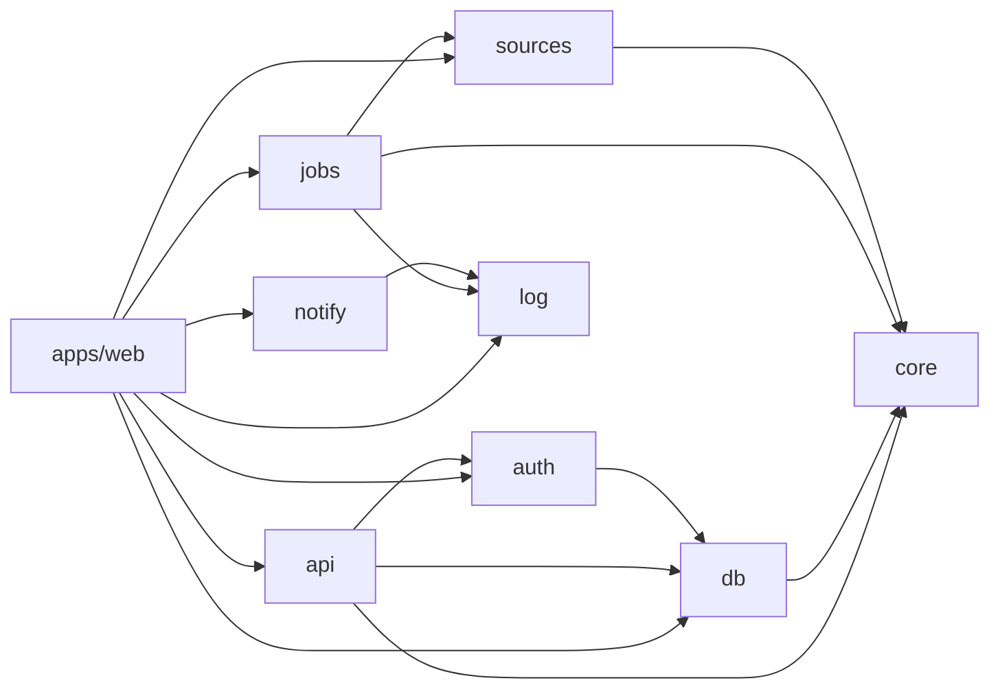

# 6. モノレポ構成

リポジトリは、画面のアプリ 1 つと、役割ごとに分けたパッケージで構成します。

```text
funmary/
├── apps/
│   └── web/           # SvelteKit。本番の入口 (server.ts) と、管理用コマンド (cli.ts) もここに置く
│       └── src/theme/ # SMUI のテーマ (ライト用とダーク用)
├── packages/
│   ├── core/          # I/O のない処理: 時間割の展開、変更の差分、ICS の生成、祝日と学期の判定
│   ├── db/            # スキーマ、マイグレーション、クエリ、暗号化とトークンの処理
│   ├── auth/          # Google ログイン、セッション、招待コード
│   ├── api/           # Hono のアプリ (/api、/auth、/cal、/feed、/mcp、/discord、/healthz)
│   ├── sources/       # 外部からの取得: 学生ポータル、公開シラバス、学年暦、祝日。取得元ごとの見張りもここ
│   ├── notify/        # 通知の送信: Discord、利用者の Webhook、管理者への通知
│   ├── jobs/          # 定期処理のタスクと、実行するかの判定
│   └── log/           # ログの出力
├── deploy/            # systemd の unit、nginx の設定、更新スクリプト
├── docs/              # 設計書 (この文書)、セルフホストの手順
├── scripts/           # ビルドとリリースの補助のスクリプト
├── AGENTS.md          # AI エージェントへの指示
├── CONTEXT.md         # 用語集。用語とコードの名前の対応
├── CONTRIBUTING.md    # 開発の決まり (コミットメッセージ、ブランチ、テスト)
├── pnpm-workspace.yaml
└── tsconfig.json
```

## 6.1 依存の向きは一方向にする



- `core` は I/O を持たず、現在時刻も引数で受け取ります。Vitest だけで確かめられます
- `api` は `notify` に依存しません。画面と API が処理中に外へ送信しない決まり ([3.5](03-quality.md#35-壊れにくさとフォールバック)) を、依存の向きでも守るためです
- `jobs` は `db` と `notify` に依存しません。定期処理が必要とする DB の読み書きや通知の送信は、引数 (`deps`) で受け取ります。つなぎ込みは `apps/web` が行います。これで、定期処理を DB なしでテストできます
- 新しいクライアントや機能を足すときは、`packages/` に新しいパッケージを足します。画面を変えずに済むようにするためです
